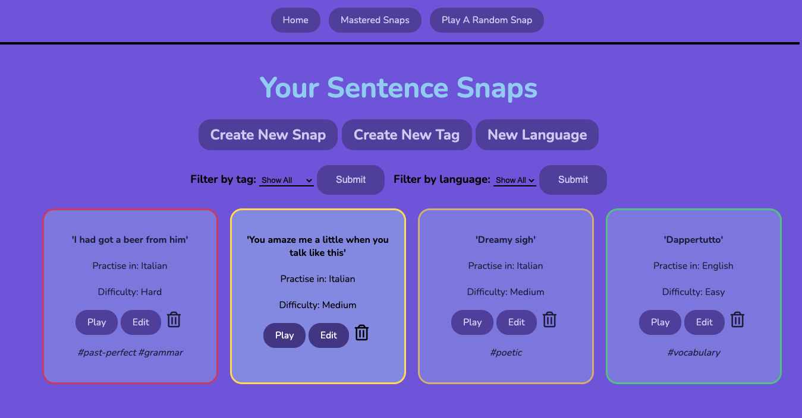
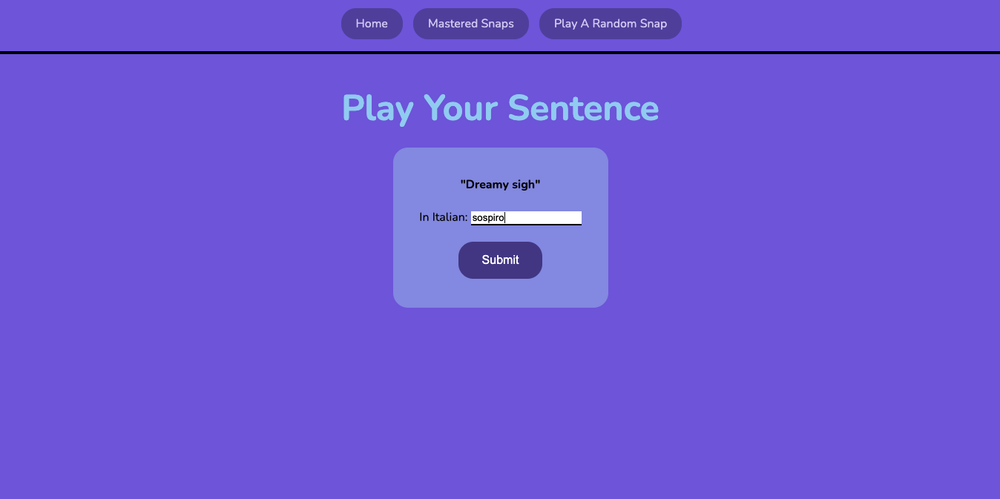
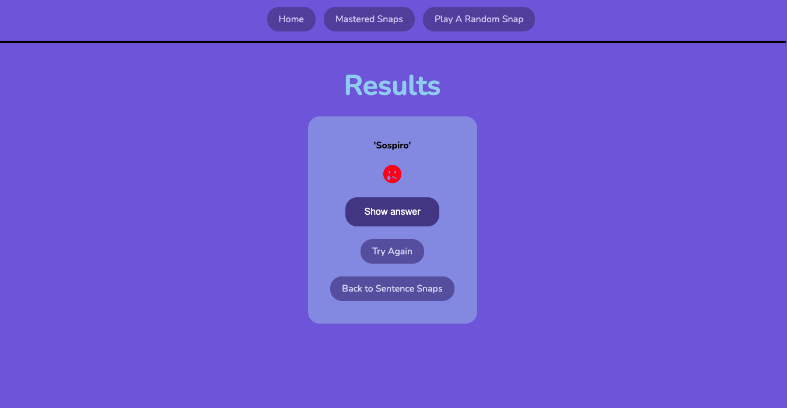
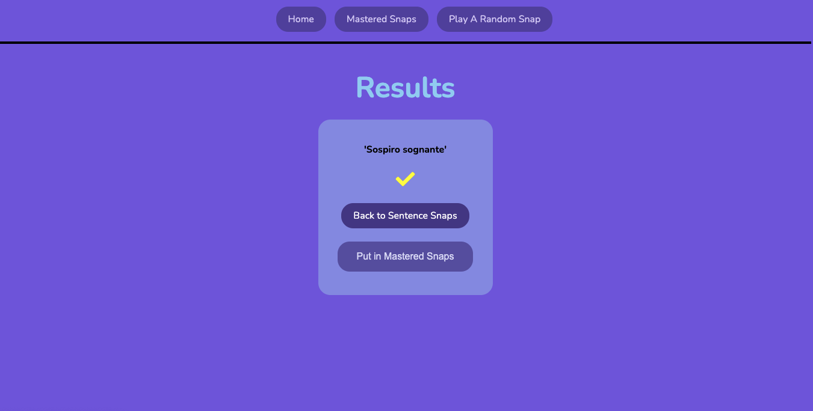
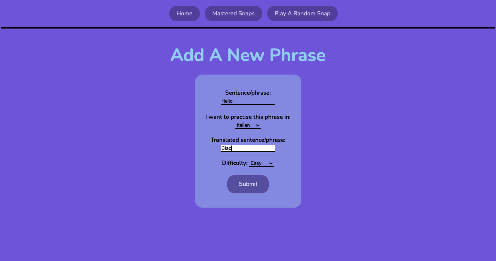
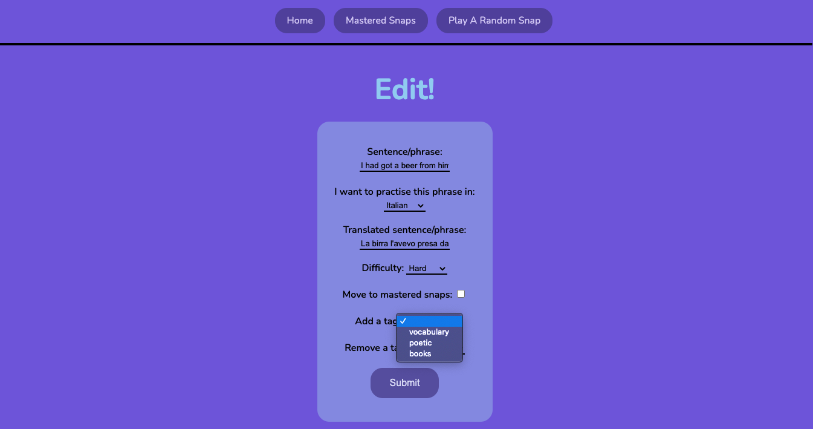

# Lingua Snaps
### Flashcard-style language practice app for language learners

Link to deployed app: [Lingua Snaps](https://lingua-snaps.herokuapp.com/).

Main features: 
 
* The user can create and store phrases in their target language and mother-tongue language
* Ability to edit and delete phrases
* Create tags and add tags to phrases 
* Ability to add languages to the system
* The user can practice phrases and get feedback on whether they were correct or not
* Phrases can be filtered by tag or language

# Languages & Technologies 

1. Python
2. Flask
3. PostgreSQL
4. HTML
5. CSS

# Screenshots

### Landing Page. 

### Practice A Phrase.

### Feedback for Incorrect Answer.

### Feedback for Correct Answer.

### Add New Phrase.

### Edit Phrase.

